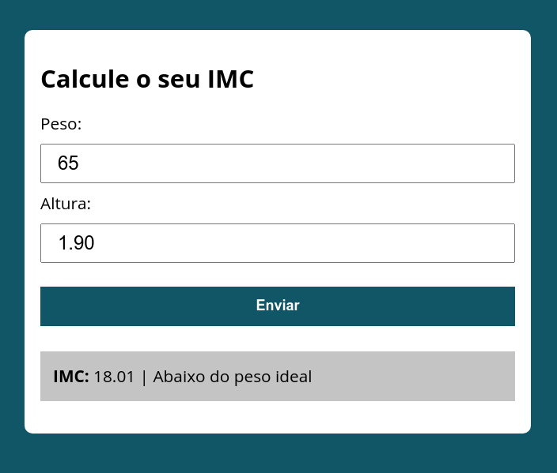
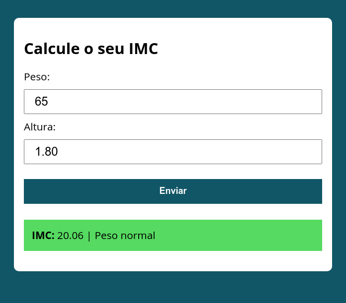
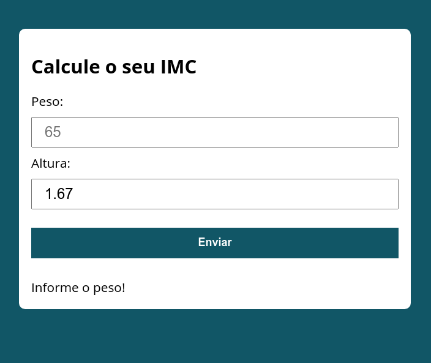

### Calculadora de IMC

Tela Inicial:

Abaixo do Peso:

Peso Normal:

Sobrepeso:

Obeso:

#### Erros e Falta de informações nos dados de entrada:

Não preencher o formulário e tentar enviar:

Sem preencher Altura ou peso:

Preencher com entrada inválida:

